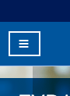
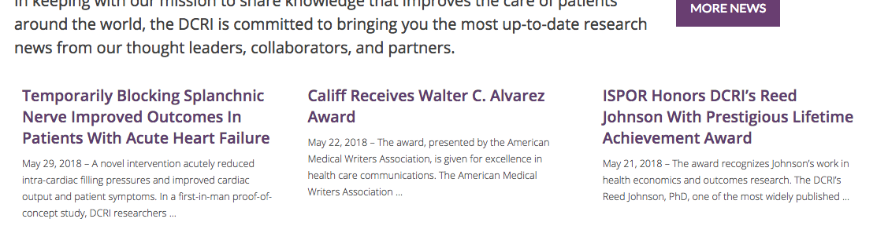

<style>
img {
	max-width:99%;
}
a {
  color: blue;
}
pre {
  font: inherit;
  word-wrap: break-word;
  background: none;
  border: none;
}
</style>

# DCRI.org Homepage Assessment
__[dcri.org](https://dcri.org)__


Congratulations on everything on your team has done to try to make this website accessible. DCRI is amoung the most accessible website we have assessed, but there are issues that would need fixed to meet WCAG 2.0 AA criteria. The visual design passed virtually every test. But there are a few issues issues with the underlying code. 

The assessment includes the homepage, landing page representative, and the contact form. The homepage assessment includes global elements such as navigation and search. Those global elements are not repeated in the other documents. When they are fixed on the homepage it should naturally propagate to the subpages. 

If you need any assistance in understanding the issues or performing the fixes please reach out to us at web-accessibility@duke.edu or 919-613-4811. We may be able to come to you to assist with the remediation. The services provided by the Web Accessibility Team are free to Duke websites.

<details>
<summary>__Table of Contents__</summary>

[toc]

</details>

## Button does not have an accessible name
When a button doesn't have an accessible name, screen readers announce it as "button", making it unusable for users who rely on screen readers. [Learn more](https://dequeuniversity.com/rules/axe/2.2/button-name?application=lighthouse).


### Mobile nav button missing value

####Visual location (mobile):


####Current code:

```html
<button class="menu-toggle fa fa-bars" type="button">    &nbsp;</button>
```

For existing websites Duke's Web Accessibility Guidelines are primarily focused on the desktop configuration of websites. And on a desktop computer this is a false positive, however it does come up on a [WAVE report](http://wave.webaim.org/report#/https://dcri.org). Even false positives need fixed because they have been used in litigation to support claims of innacessible websites.
 
On a mobile device innaccessible mobile navigation would be an obsticle. [Many people who use screen readers use mobile devices](https://webaim.org/projects/screenreadersurvey7/#mobile), sometimes as thier primary method for accessing the internet. If this was a new website we would suggest using a different mobile navigation plugin that is accessible and utilizes ARIA attributes. Just tuck that in the back of your mind for the next redesign.

####Suggested Solution:

a. Add value attribute to button element.<br>

```html
<button class="menu-toggle fa fa-bars" type="button" value="toggle mobile nav"> &nbsp;</button>
```

__[Please view Gist](https://gist.github.com/joelhsmith/071ab8e2bcd41600e97155a89e0b42a4/revisions)__

OR

b. Add invisble screen reader only text in the button element.<br>

```html
<button class="menu-toggle fa fa-bars" type="button"> &nbsp;<span class="element-invisible">toggle mobile nav</span></button>
```

__[Please view Gist](https://gist.github.com/joelhsmith/9a2580f56547d845b4e4880374513152/revisions)__

```css
.element-invisible {
  margin: 0;
  padding: 0;
  width: 1px;
  position: absolute !important;
  clip: rect(1px,1px,1px,1px);
  overflow: hidden;
  height: 1px;
}
```

OR

c. Since this is Bootstrap based theme, DCRI.org could just use its built in CSS `.sr-only` class instead.

<details>
<summary>__Additional debugging details__</summary>

_Selector path:_ <br> `[u'#site-navigation > button']`

_DOM path:_ <br>
`1,HTML,1,BODY,3,DIV,0,HEADER,5,NAV,0,BUTTON`

_Summary:_ <br>
  <pre>
Fix all of the following:
  Element is in tab order and does not have accessible text

Fix any of the following:
  Element has a value attribute and the value attribute is empty
  Element has no value attribute or the value attribute is empty
  Element does not have inner text that is visible to screen readers
  aria-label attribute does not exist or is empty
  aria-labelledby attribute does not exist, references elements that do not exist or references elements that are empty or not visible
  Element's default semantics were not overridden with role="presentation"
  Element's default semantics were not overridden with role="none"
  </pre>
</details>
<hr>

<br>
<br>

## `[id]` attributes on the page are not unique
The value of an id attribute must be unique to prevent other instances from being overlooked by assistive technologies. [Learn more](https://dequeuniversity.com/rules/axe/2.2/duplicate-id?application=lighthouse).

###"News Feed" contains repeated IDs

####Visual location:


####Current code:

```html
<ul class="lcp_catlist" id="lcp_instance_0">`
```

```html
<ul class="lcp_catlist" id="lcp_instance_0">`
```

```html
<ul class="lcp_catlist" id="lcp_instance_0">`
```

####Suggested Solution:

Remove the IDs. They do not appear to be in use by the CSS or the JS.

_Summary:_<br>
Fix any of the following:
  Document has multiple elements with the same id attribute: `lcp_instance_0`

<details>
<summary>__Additional debugging details__</summary>

_Selector path:_ <br> `[u'#three-column-list > .fl-row-content-wrap > div > .fl-node-57dc1b424aacf > .fl-node-57dc1b424ab68 > .fl-node-content > div > .fl-module-content.fl-node-content > .fl-rich-text > h3 > ul.lcp_catlist']`

_DOM path:_ <br>
`1,HTML,1,BODY,3,DIV,3,MAIN,0,DIV,0,DIV,0,ARTICLE,2,DIV,0,DIV,2,DIV,0,DIV,0,DIV,1,DIV,0,DIV,0,DIV,0,DIV,0,DIV,0,DIV,0,H3,0,UL`
</details>
<hr>

<br>
<br>

## The page has a logical tab order
Tabbing through the page follows the visual layout. Users cannot focus elements that are offscreen. [Learn more](https://developers.google.com/web/fundamentals/accessibility/how-to-review#start_with_the_keyboard).

Success.

<hr>
<br>
<br>
## [PRIORITY] Interactive controls are keyboard focusable
Custom interactive controls are keyboard focusable and display a focus indicator. [Learn more](https://developers.google.com/web/fundamentals/accessibility/how-to-review#start_with_the_keyboard).

### Rotating banner is missing required controls to make it accessible 

The website uses the [Soliloquy JS rotaing banner slider](https://soliloquywp.com/)

If the banner is is configured a specific way it can be considered adequately accessible.

Keyboard accessibility is one of the most important aspects of web accessibility. Many users with motor disabilities rely on a keyboard. Blind users also typically use a keyboard for navigation. Some people have tremors which don't allow for fine muscle control. [Learn more](https://webaim.org/techniques/keyboard/)

#####Visual location:


####What makes a carousel accessible?
- Users must be able to pause carousel movement because it can be too fast or distracting, making text hard to read.
- All functionality, including navigating between carousel items, must be operable by keyboard.
- Changes to carousel items must be communicated to all users, including screen reader users.
- The keyboard position (“focus”) is managed in a reasonable and comprehensible fashion.

####Suggested solution:

1) Add Missing pause button.<br> 
Problem: If a carousels automatically advances, it must have a pause button so people who are distracted by motion can stop it. A keyboard user needs to be able to stop the animation, especially since the aria-live attibute is set to polite. That means if the person is on the page and stop reading content, it will never stop reading the slideshow, over and over and over again.

2) Show Next and Back Controls.<br>
Problem: Currently there are no next and back buttons/links. Some people cannot use a mouse, so they would never know they could control it. They need to be visible at all times.

####Tips on how to enable those required features:

- [Configuring Your Slide](https://soliloquywp.com/docs/configuring-your-slider/)

- [How to Create a WordPress Image Gallery with Next and Previous Buttons](https://soliloquywp.com/how-to-create-a-wordpress-image-gallery-with-next-and-previous-buttons/)

<hr>
<br>
<br>

## The user's focus is directed to new content added to the page
If new content, such as a dialog, is added to the page, the user's focus is directed to it. [Learn more](https://developers.google.com/web/fundamentals/accessibility/how-to-review#start_with_the_keyboard).

Success.
<hr>
<br>
<br>
## User focus is not accidentally trapped in a region
A user can tab into and out of any control or region without accidentally trapping their focus. [Learn more](https://developers.google.com/web/fundamentals/accessibility/how-to-review#start_with_the_keyboard).

Success.
<hr>
<br>
<br>
## Custom controls have associated labels
Custom interactive controls have associated labels, provided by aria-label or aria-labelledby. [Learn more](https://developers.google.com/web/fundamentals/accessibility/how-to-review#try_it_with_a_screen_reader).

Success.
<hr>
<br>
<br>
## Custom controls have ARIA roles
Custom interactive controls have appropriate ARIA roles. [Learn more](https://developers.google.com/web/fundamentals/accessibility/how-to-review#try_it_with_a_screen_reader).

Success.
<hr>
<br>
<br>
## Visual order on the page follows DOM order
DOM order matches the visual order, improving navigation for assistive technology. [Learn more](https://developers.google.com/web/fundamentals/accessibility/how-to-review#try_it_with_a_screen_reader).

Success.
<hr>
<br>
<br>
## Offscreen content is hidden from assistive technology
Offscreen content is hidden with display: none or aria-hidden=true. [Learn more](https://developers.google.com/web/fundamentals/accessibility/how-to-review#try_it_with_a_screen_reader).

Success.
<hr>
<br>
<br>
## Headings don't skip levels
Headings are used to create an outline for the page and heading levels are not skipped. [Learn more](https://developers.google.com/web/fundamentals/accessibility/how-to-review#take_advantage_of_headings_and_landmarks).

Success.
<hr>
<br>
<br>
## HTML5 landmark elements are used to improve navigation
Landmark elements (`<main>, <nav>, etc.`) or ARIA roles are used to improve the keyboard navigation of the page for assistive technology. [Learn more](https://developers.google.com/web/fundamentals/accessibility/how-to-review#take_advantage_of_headings_and_landmarks).

Success.
<hr>
<br>
<br>